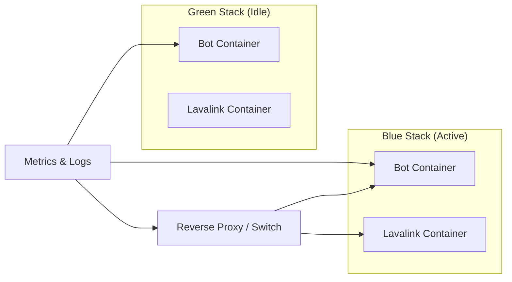
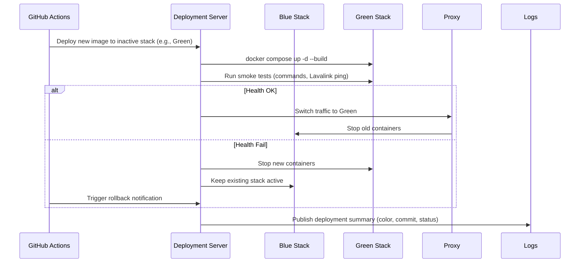
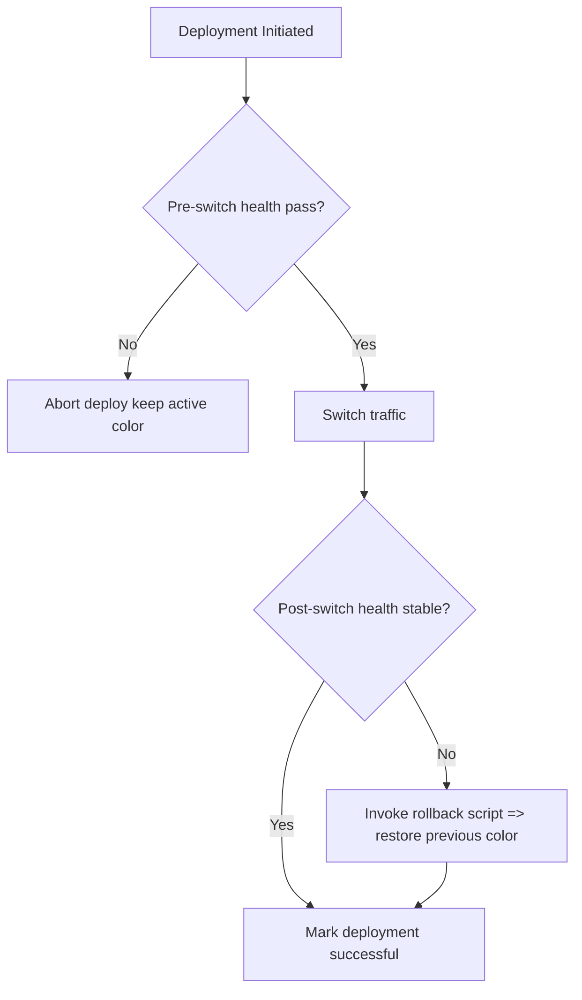

# Blue-Green Deployment and Rollback Overview

## 1. Environment Topology

**Notes**
- Only one stack is active at a time; the other is ready for the next release.
- Shared volumes (downloads, logs) must be carefully managed or namespaced per color.

## 2. Deployment Orchestration Sequence

## 3. Health Check Coverage Map
| Layer | Check Type | Tooling | Threshold |
|-------|------------|---------|-----------|
| Bot Process | Slash command invocation, heartbeat monitoring | Custom script via Discord staging guild | Success within 30s |
| Lavalink | REST `/version` ping, voice connect/disconnect | curl + mock voice session | No errors in 60s window |
| Infrastructure | Container status, resource usage | `docker inspect`, metrics collector | CPU < 70%, no restarts |
| Proxy/Switch | Target route validation | `curl` or test webhook | HTTP 200 within 2 retries |

## 4. Rollback Trigger Points

## 5. Operator Checklist
- [ ] Confirm inactive stack has latest `.env.<color>` secrets.
- [ ] Review health-check output artifacts before traffic switch.
- [ ] Verify monitoring dashboard reflects new color after cutover.
- [ ] Document deployment in release log (active color, commit, status).
- [ ] For rollback: execute `ci_rollback.sh`, verify bot reconnects, notify stakeholders.

## 6. Additional References
- Detailed implementation tasks: [`docs/suggestions/blue-green-deployment.md`](docs/suggestions/blue-green-deployment.md:1)
- Health/rollback plan: [`docs/suggestions/deployment-health-checks-rollbacks.md`](docs/suggestions/deployment-health-checks-rollbacks.md:1)