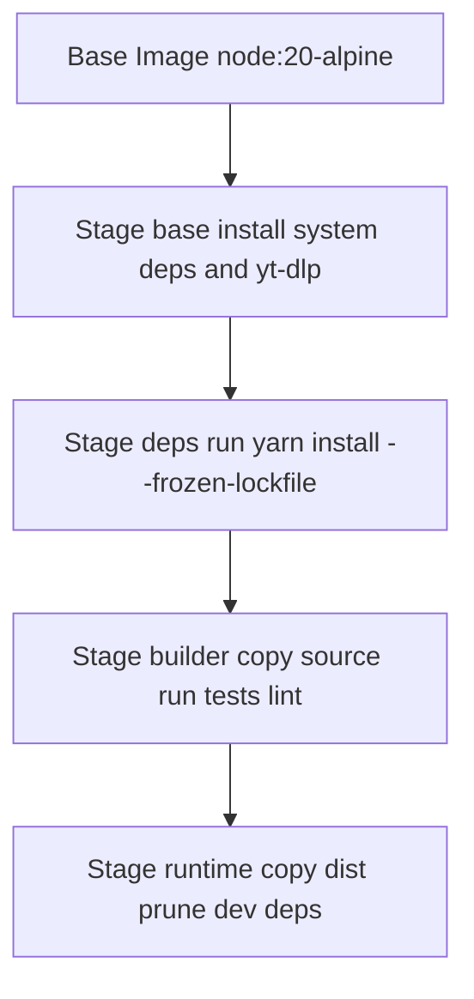
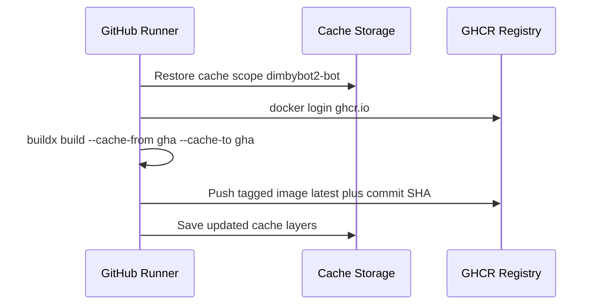
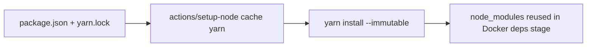

# Cache Strategy Overview for Recommendations E–G

## 1. Multi-Stage Build Layering

**Key Points**
- Stage `base` holds OS packages and shared tooling so it changes rarely.
- Stage `deps` only re-runs when `package.json` or `yarn.lock` updates.
- Stage `builder` executes verification steps without inflating the runtime image.
- Stage `runtime` contains the minimal artifacts for production deployment.

## 2. GitHub Actions Docker Layer Cache Lifecycle

**Highlights**
- `docker/setup-buildx-action` provisions BuildKit support before builds.
- `cache-from` primes the build with previous layers; `cache-to` uploads new layers.
- Separate scopes (bot vs. lavalink) prevent cache pollution.

## 3. Yarn Dependency Cache Flow

**Operational Notes**
- `actions/setup-node@v4` automatically restores node_modules into runner cache.
- `yarn install --immutable` fails if lockfile and installed modules diverge, ensuring reproducibility.
- Docker dependency stage copies cached `node_modules` into the image, significantly reducing build time.

## 4. Coordination Checklist
- [ ] Confirm `.dockerignore` excludes `downloads/`, `docs/`, and other volatile content.
- [ ] Ensure BuildKit (`DOCKER_BUILDKIT=1`) is enabled locally for parity.
- [ ] Provide manual cache bust option (workflow input) in case of corruption.
- [ ] Monitor cache usage via GitHub Actions cache dashboard to avoid quota exhaustion.